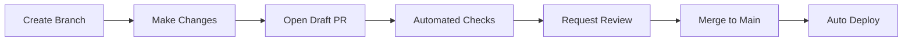

# Pragmatic GitHub Organization Setup for Growing Development Teams

## Executive Summary

This strategy prioritizes **developer velocity** and **organic growth** over heavy enterprise processes. Instead of implementing complex governance upfront, we build a foundation that scales naturally with your team while maintaining professional standards from day one.

**Core Philosophy:** Start simple, measure impact, iterate based on real needs rather than theoretical requirements.

---

## 1. GitHub Organization Architecture: "Single Hub" Approach

### Why This Differs from Enterprise Approaches

**Traditional Enterprise:** Multiple organizations, complex access matrices, heavy governance
**Our Approach:** Single organization with smart team structures that grow organically

### Initial Setup (Day 1-7)

```
YourCompany GitHub Organization
├── Core Repositories (Public/Internal visibility)
│   ├── company-handbook (living documentation)
│   ├── developer-resources (templates, guides)
│   └── project-templates (starter kits)
├── Product Repositories (Private)
│   ├── main-product-frontend
│   ├── main-product-backend
│   └── shared-libraries
└── Experimental Repositories (Private/Internal)
    ├── spike-experiments
    └── proof-of-concepts
```

### Team Structure (Grows with headcount)

**Phase 1 (2-10 developers):**
- `@core-team` (all developers, admin access)
- `@product-owners` (product stakeholders, read access)

**Phase 2 (10-25 developers):**
- `@frontend-team` (maintain + write to frontend repos)
- `@backend-team` (maintain + write to backend repos)
- `@platform-team` (infrastructure, maintain + write to all)
- `@product-team` (stakeholders, read access to all)

**Phase 3 (25+ developers):**
- Feature-based teams: `@payments-team`, `@user-auth-team`
- Cross-functional teams: `@mobile-team`, `@data-team`
- Support teams: `@devops-team`, `@security-team`

### Repository Organization Principles

1. **Visibility by Default:** Start with internal visibility, move to private only when needed
2. **Naming Convention:** `project-component-purpose` (e.g., `marketplace-api-core`)
3. **Template Standardization:** Every repo type has a template (more on this below)

---

## 2. Development Workflow Design: "Progressive Complexity"

### Core Workflow (Week 1 Implementation)

**GitHub Flow with Safety Rails:**



### Branch Protection Rules (Minimal but Effective)

```yaml
Main Branch Protection:
  - Require pull request reviews: 1 reviewer minimum
  - Dismiss stale reviews: false (reduces friction)
  - Require status checks: true
  - Require branches to be up to date: false (reduces merge conflicts)
  - Restrict pushes: true (only via PRs)
  - Allow force pushes: false
  - Allow deletions: false
```

### Review Process Philosophy

**Instead of:** Mandatory 2+ reviewers, blocking approvals, complex review matrices
**We use:** 
- **1 reviewer minimum** (can be anyone on the team)
- **Auto-approval for trusted patterns** (dependency updates, documentation)
- **Escalation paths** (complex changes get tagged for senior review)

### Draft PR Workflow

Encourage developers to open PRs as drafts early:
1. Gets CI feedback immediately
2. Enables early collaboration
3. Reduces work-in-progress bottlenecks
4. Creates natural documentation of thought process

---

## 3. Code Quality & Review Processes: "Build Quality In"

### Automated Quality Gates (No Manual Overhead)

**Tier 1 - Immediate Feedback (< 2 minutes):**
- Linting and formatting (ESLint, Prettier, Black)
- Unit tests (must pass to merge)
- Security scanning (CodeQL, Snyk)
- Type checking (TypeScript, mypy)

**Tier 2 - Pre-merge (< 10 minutes):**
- Integration tests
- Build verification
- Performance regression tests
- Documentation generation

**Tier 3 - Post-merge (< 30 minutes):**
- End-to-end tests
- Full security audit
- Dependency vulnerability scans

### Review Guidelines (Not Rules)

```markdown
## Good Reviews Focus On:
✅ Logic errors and edge cases
✅ Performance implications
✅ Security considerations
✅ Maintainability concerns

## Reviews Should NOT Focus On:
❌ Code style (automated)
❌ Formatting (automated)
❌ Personal preferences
❌ Architecture changes (separate discussion)
```

### Quality Metrics That Matter

Track these automatically, review monthly:
- **Time to first review** (target: < 4 hours)
- **PR size distribution** (encourage smaller PRs)
- **Review thoroughness** (comments per PR, catch rate)
- **Deployment success rate** (target: > 95%)

---

## 4. CI/CD Pipeline Strategy: "Ship Small, Ship Often"

### Pipeline Philosophy

**Instead of:** Complex, multi-stage pipelines with manual approvals
**We build:** Simple, fast pipelines with smart automation

### Core Pipeline (Implemented in 2 weeks)

```yaml
# .github/workflows/main.yml
name: Main Pipeline
on:
  pull_request:
  push:
    branches: [main]

jobs:
  test:
    runs-on: ubuntu-latest
    steps:
      - uses: actions/checkout@v4
      - name: Setup Environment
        uses: ./.github/actions/setup
      - name: Run Tests
        run: npm run test:ci
      - name: Security Scan
        uses: github/codeql-action/analyze@v2
  
  deploy-staging:
    if: github.ref == 'refs/heads/main'
    needs: test
    runs-on: ubuntu-latest
    steps:
      - name: Deploy to Staging
        run: ./scripts/deploy-staging.sh
  
  deploy-production:
    if: github.ref == 'refs/heads/main'
    needs: deploy-staging
    runs-on: ubuntu-latest
    environment: production
    steps:
      - name: Deploy to Production
        run: ./scripts/deploy-production.sh
```

### Deployment Strategy

1. **Every PR → Preview Environment** (automatic)
2. **Main branch → Staging** (automatic)
3. **Main branch → Production** (automatic with 5-minute delay)
4. **Rollback capability** (one-click revert)

### Environment Management

- **Development:** Local + Docker Compose
- **Staging:** Cloud environment (mirrors production)
- **Production:** Blue-green deployment
- **Preview:** Ephemeral environments for PRs

---

## 5. Team Collaboration Tools: "Reduce Context Switching"

### GitHub-Centric Collaboration

**Everything in GitHub Issues/PRs:**
- Feature requests → GitHub Issues with templates
- Bug reports → GitHub Issues with auto-triage labels
- Technical discussions → GitHub Discussions
- Documentation → Markdown in repos
- Project planning → GitHub Projects (not external tools)

### Issue Templates

```markdown
# Bug Report Template
## Expected Behavior
[What should happen]

## Actual Behavior
[What actually happens]

## Steps to Reproduce
1. 
2. 
3. 

## Environment
- Browser/Device:
- Version:
- Other relevant info:

/label bug
/assign @team-lead
```

### Labels That Scale

**Priority:** `P0-critical`, `P1-high`, `P2-medium`, `P3-low`
**Type:** `bug`, `enhancement`, `documentation`, `technical-debt`
**Team:** `team:frontend`, `team:backend`, `team:platform`
**Status:** `needs-investigation`, `ready-for-dev`, `in-progress`, `blocked`

### Automation Rules

- Auto-assign issues based on file paths
- Auto-label PRs based on changed files
- Auto-close issues when related PRs merge
- Weekly digest of team activity

---

## 6. Project Management Integration: "Lightweight Planning"

### GitHub Projects Setup

**Instead of:** Heavy project management tools (Jira, Azure DevOps)
**We use:** GitHub Projects with custom fields

### Project Board Structure

```
Sprint Board (Current work)
├── Backlog (prioritized)
├── Ready for Development
├── In Progress
├── In Review
├── Testing
└── Done

Epic Board (Long-term planning)
├── Ideas
├── Planned (next quarter)
├── In Progress
└── Completed
```

### Custom Fields for Issues

- **Story Points:** 1, 2, 3, 5, 8 (simple estimation)
- **Team:** Dropdown of team names
- **Priority:** P0, P1, P2, P3
- **Type:** Feature, Bug, Technical Debt, Documentation

### Planning Rhythm

**Weekly:** Team sync on current sprint, adjust priorities
**Monthly:** Sprint planning, epic refinement
**Quarterly:** Roadmap planning, team health metrics

---

## 7. Documentation Approach: "Living Documentation"

### Documentation Philosophy

**Traditional:** Heavy upfront documentation that becomes outdated
**Our approach:** Documentation that evolves with the code

### Documentation Structure

```
docs/
├── README.md (project overview, quick start)
├── CONTRIBUTING.md (development setup)
├── API.md (generated from code comments)
├── ARCHITECTURE.md (high-level design)
├── DEPLOYMENT.md (operations guide)
└── TROUBLESHOOTING.md (common issues)
```

### Automated Documentation

- **API docs:** Generated from code comments (Swagger/OpenAPI)
- **Architecture diagrams:** Generated from code structure
- **Dependency graphs:** Auto-updated on changes
- **Change logs:** Generated from PR descriptions

### Documentation Standards

1. **README-driven development:** Write README before code
2. **Code comments for "why," not "what"**
3. **Decision records:** Document important architectural decisions
4. **Runbooks:** Step-by-step guides for common operations

---

## 8. Training & Onboarding Strategy: "Learn by Doing"

### Day 1: Developer Setup

**Automated Onboarding Checklist:**
- [ ] GitHub account created and added to organization
- [ ] Development environment setup (automated script)
- [ ] First PR opened (documentation improvement)
- [ ] Team introductions (async via GitHub Discussions)

### Week 1: Core Workflows

**Practical Exercises:**
1. Fix a documentation typo (learn PR process)
2. Add a unit test (learn testing workflow)
3. Fix a minor bug (learn debugging process)
4. Review a teammate's PR (learn review process)

### Month 1: Advanced Patterns

**Progressive Learning:**
- Deployment process (shadow a senior developer)
- Architecture decisions (participate in technical discussions)
- Code quality practices (run static analysis locally)
- Team processes (attend sprint planning)

### Continuous Learning

**Monthly Learning Sessions (1 hour):**
- New GitHub features and best practices
- Security awareness and threat modeling
- Code quality techniques and tools
- Team retrospectives and process improvements

### Mentorship Program

- **Buddy System:** Every new developer paired with experienced team member
- **Code Review Mentoring:** Experienced developers provide detailed feedback
- **Career Development:** Quarterly discussions about growth and learning goals

---

## Implementation Timeline

### Week 1-2: Foundation
- Set up GitHub organization and initial repositories
- Configure basic branch protection and CI/CD
- Create issue and PR templates
- Establish team structure and permissions

### Week 3-4: Workflow Implementation
- Implement automated quality checks
- Set up deployment pipeline
- Configure GitHub Projects for planning
- Create documentation templates

### Month 2: Process Refinement
- Gather feedback from team on initial processes
- Adjust workflows based on real usage patterns
- Implement advanced automation
- Establish metrics and monitoring

### Month 3+: Continuous Improvement
- Regular retrospectives and process updates
- Scale team structure as organization grows
- Add new tools and integrations as needed
- Measure and optimize developer experience

---

## Why This Approach Works Better Than Enterprise Solutions

### 1. **Developer Velocity Over Governance**
- Start simple, add complexity only when needed
- Automate quality instead of adding manual gates
- Prioritize shipping over perfect processes

### 2. **Organic Growth Over Rigid Structure**
- Team structure evolves with actual needs
- Processes adapt to real workflow patterns
- Tools scale naturally with team size

### 3. **Practical Learning Over Extensive Training**
- Learn by doing instead of comprehensive upfront training
- Just-in-time learning reduces cognitive overhead
- Mentorship provides context and nuance

### 4. **Measurable Outcomes Over Theoretical Best Practices**
- Track metrics that matter to business outcomes
- Iterate based on data, not opinions
- Focus on developer experience and productivity

### 5. **GitHub-Native Over Tool Sprawl**
- Reduce context switching between tools
- Leverage GitHub's integrated features
- Maintain single source of truth

---

## Success Metrics

### Developer Experience
- Time from hire to first PR merged: < 3 days
- Time to resolve issues: < 1 week average
- Developer satisfaction: > 4.5/5 in quarterly surveys
- Knowledge sharing: All team members contribute to documentation

### Code Quality
- Deployment success rate: > 95%
- Time to detect issues: < 1 hour
- Security vulnerabilities: Zero high-severity in production
- Test coverage: > 80% for critical paths

### Team Productivity
- PR review time: < 4 hours median
- Feature delivery time: 25% reduction quarter-over-quarter
- Cross-team collaboration: Increasing inter-team PRs and discussions
- Process overhead: < 10% of development time spent on non-coding activities

---

This approach transforms GitHub from a code repository into a comprehensive development platform that grows with your team while maintaining the agility and focus that makes startups successful.